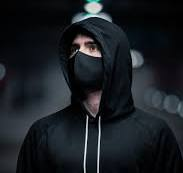

<div align="center">

# 😷 Face Mask Detection using Deep Learning (CNN + TensorFlow)


**This project detects whether a person is wearing a face mask or not using a Convolutional Neural Network (CNN) model built with TensorFlow/Keras.**

**The model was trained on the Face Mask Dataset with advanced data augmentation, achieving 97.5% test accuracy.**

**A Streamlit web app allows users to upload custom images and instantly get mask predictions.**

</div>

---

## 🚀 Demo

<div align="center">

🎥  

</div>

---

## 🧠 Model Overview

<table>
<tr>
<td>

- **Architecture:** Custom CNN with Batch Normalization and Dropout layers  
- **Loss Function:** Binary Crossentropy  
- **Optimizer:** Adam  
- **Evaluation Metrics:** Accuracy, Loss  
- **Frameworks:** TensorFlow, Keras, OpenCV  
- **Final Accuracy:** ✅ **97.5%**

</td>
</tr>
</table>

---

## 🧩 Features

<table>
<tr>
<td width="50%">

✅ Real-time **mask vs. no-mask detection**

✅ **Data augmentation** for better generalization

✅ **Batch Normalization & Dropout** to prevent overfitting

</td>
<td width="50%">

✅ Interactive **Streamlit web interface**

✅ Model trained and validated on **augmented dataset**

</td>
</tr>
</table>

---

## 📸 Example Predictions

<div align="center">

| Input Image | Model Prediction |
|-------------|------------------|
|  | 😷 **With Mask** |
|---------------------------------|-----------------|
|  | ❌ **Without Mask** |

</div>

---

## 🧰 Tech Stack

<div align="center">


</div>

**Technologies Used:**
- **Python 3.10+**
- **TensorFlow / Keras**
- **OpenCV**
- **NumPy**
- **Matplotlib**
- **Streamlit**
- **Pillow**

---

## 📦 Installation & Setup

### 1️⃣ Clone the Repository

```bash
git clone https://github.com/junaidniazi1/face-mask-detection.git
cd face-mask-detection
```

### 2️⃣ Install Dependencies

```bash
pip install -r requirements.txt
```

### 3️⃣ Run the Streamlit App

```bash
streamlit run app.py
```

---

## 🧪 Model Performance

<div align="center">

| Metric              | Value  |
|---------------------|--------|
| Training Accuracy   | 97.56% |
| Validation Accuracy | 97.52% |
| Test Loss           | 0.0816 |

</div>

---

## 🧾 Requirements

```txt
tensorflow==2.15.0
opencv-python-headless
streamlit
numpy==1.26.4
h5py==3.10.0
matplotlib
pandas
Pillow
```

---

## 🧑‍💻 Author

<div align="center">

**Junaid Khan**

*Data Engineer & Deep Learning Enthusiast*

📧 Email: [junaidkhan99e9@gmail.com](mailto:your-email@example.com)

🔗 GitHub: [github.com/junaidniazi1](https://github.com/junaidniazi1)

</div>

---

## 🏁 License

<div align="center">

This project is licensed under the **MIT License**

You are free to use, modify, and distribute it with attribution.

</div>

---

## 🌟 Acknowledgments

**Dataset:** Face Mask Detection Dataset from Kaggle

**Special Thanks:** TensorFlow and Streamlit communities for open-source support

---

<div align="center">

⭐ **If you found this project helpful, please consider giving it a star!** ⭐

</div>
